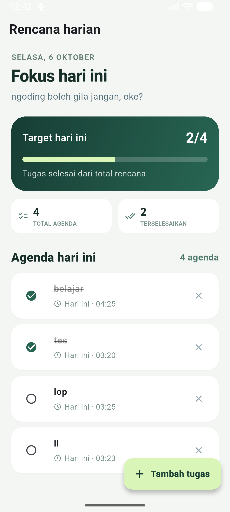
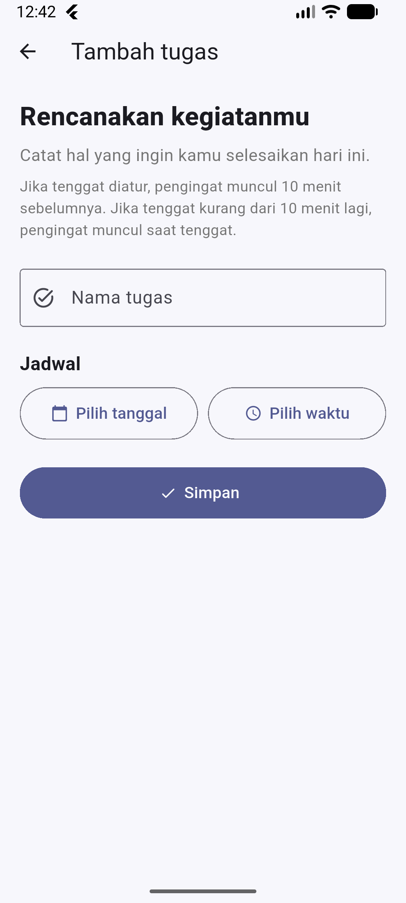

# ServerHub

> Modern mobile application built with Expo & React Native.

<div align="center">


</div>

---

## 📱 Preview

<div align="center">





</div>

---

## ✨ Features

- 🏠 Modern dashboard
- 📊 Server monitoring
- 🔔 Notifications
- 👤 User profile
- ⚡ Fast and responsive UI
- 🌙 Dark mode

---

## 🛠️ Tech Stack

| Technology | Usage |
|---|---|
| React Native | Mobile UI |
| Expo | Development platform |
| TypeScript | Programming language |
| Expo Router | Navigation |

---

## Getting Started

### 1. Clone repository

```bash
git clone https://github.com/nuby911/prooject-RivalNVDIA.git
cd REPOSITORY

# app

A new Flutter project.

## Getting Started

This project is a starting point for a Flutter application.

A few resources to get you started if this is your first Flutter project:

- [Learn Flutter](https://docs.flutter.dev/get-started/learn-flutter)
- [Write your first Flutter app](https://docs.flutter.dev/get-started/codelab)
- [Flutter learning resources](https://docs.flutter.dev/reference/learning-resources)

For help getting started with Flutter development, view the
[online documentation](https://docs.flutter.dev/), which offers tutorials,
samples, guidance on mobile development, and a full API reference.
